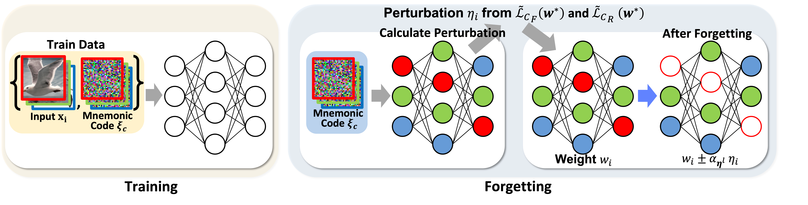

# One-Shot Machine Unlearning with Mnemonic Code



### Table: Comparison results in $E_\mathrm{F}$
We evaluate the baseline and our methods three times and provide the mean and standard deviation.
The highest values are shown in bold.

|          | MNIST         | CIFAR10       | CUB           | STN           |
|----------|---------------|---------------|---------------|---------------|
| FastMU   | 98.0 ± 0.3    | **100 ± 0.0** | 68.6 ± 12.0   | 60.9 ± 6.9    |
| LwSF     | 94.4 ± 1.7    | **100 ± 0.0** | 93.1 ± 7.0    | 98.2 ± 1.8    |
| SFDN     | **100 ± 0.0** | 96.3 ± 2.5    | **100 ± 0.0** | **100 ± 0.0** |
| SSD      | 93.1 ± 0.0    | **100 ± 0.0** | **100 ± 0.0** | **100 ± 0.0** |
| ERM-KTP  | -             | **100 ± 0.0** | **100 ± 0.0** | **100 ± 0.0** |
| Ours     | **100 ± 0.0** | **100 ± 0.0** | **100 ± 0.0** | **100 ± 0.0** |

### Table: Comparison results in $A_\mathrm{R}$ 
We evaluate the baseline and our methods three times and provide the mean and standard deviation.
The highest values are shown in bold.

|          | MNIST         | CIFAR10       | CUB           | STN           |
|----------|---------------|---------------|---------------|---------------|
| FastMU   | 96.5 ± 0.1    | 90.4 ± 0.5    | 73.1 ± 1.3    | 88.0 ± 0.1    |
| LwSF     | 43.7 ± 9.6    | 65.4 ± 16.6   | 68.2 ± 3.5    | 80.1 ± 6.7    |
| SFDN     | 94.1 ± 0.7    | 93.4 ± 0.2    | 78.2 ± 0.6    | 88.3 ± 0.6    |
| SSD      | **96.9 ± 0.0**| 94.2 ± 0.0    | 44.3 ± 0.0    | 74.4 ± 0.0    |
| ERM-KTP  | -             | 92.7 ± 0.4    | 42.8 ± 3.2    | 75.6 ± 4.0    |
| Ours     | 95.9 ± 0.1    | **94.4 ± 0.1**| **79.3 ± 0.7**| **91.7 ± 0.3**|


Code for One-Shot Machine Unlearning with Mnemonic Code

## Environment
```
torch==2.0.0+cu117
torchvision==0.15.1+cu117
```

## Argument
--conf: Path to the configuration file for experiment.

## Arguments in conf file
```
--seed: Random seed for the experiment.
--dataname: Using data (mnist, cifar10, cub, stn, imagenet).
--num_classes: Class size of the dataset.
--t_mix: The probability of replacing the training data with the mnemonic codes
--model: Target model (mlp, resnet18, pretrained-resnet18).
--train_batch: Batch size for training.
--opt: Optimizer for training.
--epochs: Epochs for training.
--lr: Learning rate for training.
--weight_decay: The size of weight decay.
--scheduler: Scheduler for training.
--forget_idx: The forgetting class.
--lambda1: $\lambda_1$ in main paper.
--lambda2: $\lambda_2$ in main paper.
```

## Command
Experiment for MNIST (Download for MNIST will begin in ./data).
```
python3 main.py --conf conf/mnist.yaml
```

Experiment for CIFAR10 (Download for CIFAR10 will begin in ./data).
```
python3 main.py --conf conf/cifar.yaml
```

Experiment for CUB (You should put the CUB dataset in ./data).
```
python3 main.py --conf conf/cub.yaml
```

Experiment for STN (You should put the STN dataset in ./data).
```
python3 main.py --conf conf/stn.yaml
```
